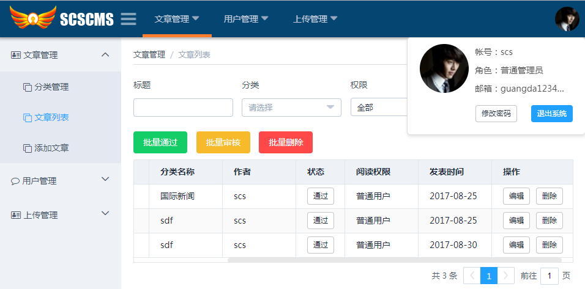

# vue-scscms

基于koa2+mysql+vue2.0+Element阳光内容管理系统

    简单文章系统模板，含注册、登录、权限管理、用户管理范例。旨在提供一个完整的前后台node+vue2.0开发的脚手架，由您按需扩展。

### 功能简介
	1.用户注册：邮箱激活帐号、邮箱密码找回；用户登录使用token验证。
	2.用户管理：新增帐号、编辑用户、删除用户、激活用户；
	3.分类管理：无限级文章分类管理；
	4.文章管理：文章审核、新增、编辑、删除；
	5.上传管理：删除上传文件、删除上传记录；

### 在线预览


[点击查看在线DEMO](http://103.27.4.146:3001)

**测试帐号**

user：`vip会员`   password：`vip123`

### 安装

```
git clone https://github.com/scscms/vue-scscms.git

//先git克隆或者下载下来，进入项目目录执行npm命令

npm install
```

#### Node.js要求：

基于 Koa2, 使用了异步函数，其中Node.js版本要求不能底于v7.6.0

### 特别说明

- 1.如果您只是想查看效果可执行

```
npm run dev
```

然后注册帐号并激活，登录，开始旅途。

注意：因使用公用数据库，且开放最大权限供所有人体验，所以所有资料都有可能被其他用户修改或删除的可能！

- 2.安装私有数据库

默认情况下使用的是公用数据库。为了达到更好的用户体验和数据安全推荐您自己安装mysql来测试。
首先安装mysql和新建用户等，教程自行解决。
接着在mysql新建数据库和建表，为了方便操作在此已经提供sql文档：参见`server/mysql.sql`

- 然后打开文件`server/config.js`修改数据库和邮箱配置。

- 然后打开文件`config/index.js`修改`target: 'http://103.27.4.146:3001'`为你自己的服务器地址，默认为`target: 'http://localhost:3001',`。

- 然后打开文件`server/common.js`修改`web_domain: 'http://103.27.4.146:3001'`为你自己的服务器地址，默认为`web_domain: 'http://localhost:3001',`。

- 最后执行npm脚本：

```
npm run start #运行前后端（开发）
```

开始您的愉快之旅。

注意：在开发环境下上传的图片不能正常访问，需要在生产环境下才能正常浏览图片！（编辑器中的图片使用的是beas64不受此影响）

- 开始完成后打包

```
npm run build
```

- 上线后只运行服务

```
npm run server
```
## 添加ESLint语法检查（可选）

- 安装依赖包

```
$ npm install eslint babel-eslint eslint-loader -D
```
- 新建配置文件

```
$ node_modules\.bin\eslint --init
? How would you like to configure ESLint? (Use arrow keys)
  Answer questions about your style
❯ Use a popular style guide #选择并回车
  Inspect your JavaScript file(s)
? Which style guide do you want to follow? (Use arrow keys)
  Google
  Airbnb
❯ Standard #选择并回车
? What format do you want your config file to be in? (Use arrow keys)
❯ JavaScript #选择并回车
  YAML
  JSON
```
然后会自动安装5个依赖包。并自动生成`.eslintrc.js`文件，修改此文件为：

```
module.exports = {
  "extends": "standard",
  "plugins": [
    "html"
  ],
  "parser": "babel-eslint"
};
```

- 添加预处理功能：build/webpack.base.conf.js

```
 {
    test: /\.(vue|js|jsx)$/,
    loader: 'eslint-loader',
    include:[path.resolve(__dirname, '../src'),path.resolve(__dirname, '../server')],
    enforce: 'pre'
}
```

- 添加node命令：package.json
```
"scripts": {
    ...
    "lint": "eslint --ext .js --ext .vue src/",
    "lint-fix": "eslint --fix --ext .js --ext .vue src/"
}
```
```
$ npm run lint #语法检查
$ npm run lint-fix #语法检查并尝试修正
```
## 项目架构

```

├── build // vue-cli 生成，用于webpack监听、构建
│   ├── build.js
│   ├── check-versions.js
│   ├── dev-client.js
│   ├── dev-server.js
│   ├── utils.js
│   ├── webpack.base.conf.js
│   ├── webpack.dev.conf.js
│   └── webpack.prod.conf.js
├── config
│   ├── default.conf
│   ├── dev.env.js
│   ├── index.js
│   └── prod.env.js
├── dist // Vue build 后的文件夹
│   ├── index.html // 入口文件
│   └── static // 静态资源
├── server // Koa后端，用于提供Api
│   ├── api.js // api接口文件，几乎所有后台接口
│   ├── common.js // 前后台共用配置参数，包括权限配置
│   ├── config.js // 后台配置文件夹，主要是数据库及邮箱服务配置
│   ├── mysql.sql // 数据库表文档
│   └── routes.js // 后台route-路由
├── src // vue-cli 生成&自己添加的utils工具类
│   ├── assets // 相关静态资源存放
│   ├── components // 公用组件
│   │      ├── index.js
│   │      └── upFile.vue // 上传组件
│   ├── page // 单文件组件
│   │    ├── Article // 文章
│   │    │     ├── add.vue //添加、编辑文章
│   │    │     ├── list.vue //文章列表
│   │    │     └── sort.vue //文章分类
│   │    ├── UpFile // 上传
│   │    │     └── list.vue //上传列表
│   │    ├── User // 用户
│   │    │     ├── add.vue //添加、编辑用户
│   │    │     └── list.vue //用户列表
│   │    ├── Home.vue //公共首页
│   │    ├── Login.vue // 登录页、注册页
│   │    └── NoFind.vue // 404页面
│   ├── store // vuex文件
│   │    ├── index.js
│   │    └── userInfo.js // 缓存用户信息
│   ├── utils // 插件
│   │    ├── index.js
│   │    ├── ajax.js  //axios封装请求
│   │    └── storage.js // localStorage缓存
│   ├── main.js // 引入Vue等资源、挂载Vue的入口js
│   ├── utils // 工具文件夹-封装的可复用的方法、功能
│   │     ├── ajax // 封装axios的通用请求
│   │     └── storage //本地存储方法
│   ├── App.vue // 主文件
│   ├── main.js // 入口文件
│   ├── App.vue // 主文件
│   └── routes.js // 前端路由
├── static // 前端静态文件
│   └── style.css // 样式
├── .babelrc // babel工具，ES6转ES5配置
├── .editorconfig // 编辑器格式配置
├── .gitignore // Git之忽略文件
├── .postcssrc.js // postcss配置文件
├── app.js  // Koa入口文件
├── favicon.ico // ico图标
├── index.html // 首页模板
├── log.txt  // 后端请求日志
├── package.json // npm的依赖、项目信息文件
├── README.md	//说明文档
├── server-entry.js // 后端服务入口文件

```

### 后台API接口说明

- 1、login   : 用户登录（访问权限：游客）
- 2、register: 用户注册（访问权限：游客）
- 3、active: 帐号激活（访问权限：游客）
- 4、retrieve: 找回密码（访问权限：游客）
- 5、findPassword: 激活找回密码（访问权限：游客）
- 6、changePassword' : 修改密码（访问权限：所有用户）
- 7、listSort: 分类列表（访问权限：自定义）
- 8、updateSort: 更新分类（访问权限：自定义）
- 9、deleteSort: 删除分类（访问权限：自定义）
- 10、batchDelSort: 批量删除分类（访问权限：自定义）
- 11、upFile: 上传权限（访问权限：自定义）
- 12、listUpFile: 上传文件列表（访问权限：自定义）
- 13、delFile: 删除上传文件（访问权限：自定义）
- 14、listUser: 用户列表（访问权限：自定义）
- 15、updateUser' : 更新用户（访问权限：自定义）
- 16、getUserById: 通过ID获取用户信息（访问权限：同updateUser）
- 17、passedUser: 审核用户（访问权限：自定义）
- 18、deleteUser: 删除用户（访问权限：自定义）
- 19、upUserPic: 用户上传头像（访问权限：所有用户）
- 20、listArticle: 文章列表（访问权限：自定义）
- 21、updateArticle: 更新文章（访问权限：自定义）
- 22、passedArticle: 审核文章（访问权限：自定义）
- 23、deleteArticle: 删除文章（访问权限：自定义）
- 24、getArticleById: 通过ID获取文章详情（访问权限：游客）

### 实践项目

- [前端监控系统monitor](https://github.com/scscms/scs-monitor)

### 后记

因时间关键，原计划还要做上前台界面和文章评论，姑且放到下一个版本来制作了。时间匆忙难免错漏，肯请指正。
并欢迎交流学习，并献上您的宝贵意思。
QQ群：25702761
guangda1234@126.com 或
[在线联系](https://gitter.im/ElemeFE/element)

---
